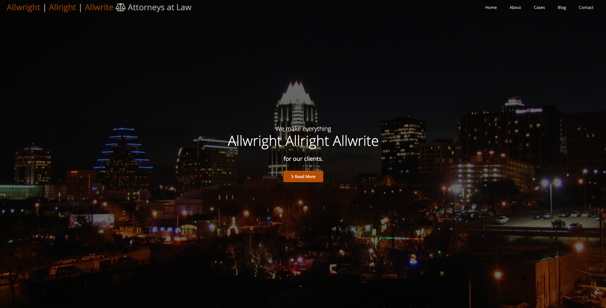
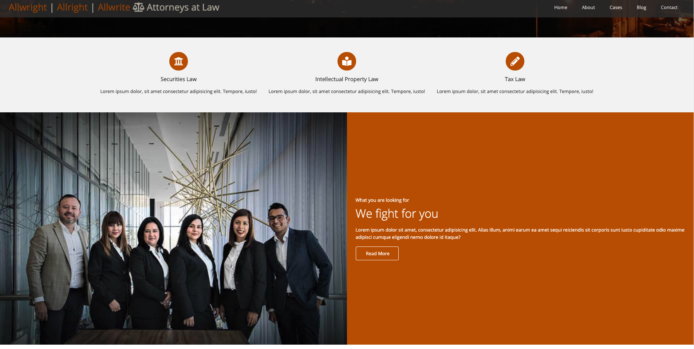

	<h1> Legal Services Website Template</h1>
	

	<h5>by</h5>
	

## Project Description
Legal services template for the fictional firm of Allwright, Allright and Allwrite (a shout out to the character David Wooderson played by Austinite, Matthew McConauhey, in the cult classic Dazed and Confused and his famous line: Alright, Alright, Alright!) includes a landing page with full page image of the Austin, Texas skyline at night, About page, Cases overview, Blog, and Contact Page. The color pallette used is University of Texas burnt orange, cream, and white. The project was built using HTML5, CSS3 and Font-Awesome5.

## Screenshots
	

		
		
		
		
		
		
		
	
		
		
		
	

	

## Tech/framework used

<b>Built with</b>

Html5 and Css3

## Features
<ul>
	<li>About Page</li>
	<li>Client Cases</li>
	<li>Blog</li>
	<li>Contact Form</li>
</ul>

## License

MIT © [Kris Paschal] 2020
